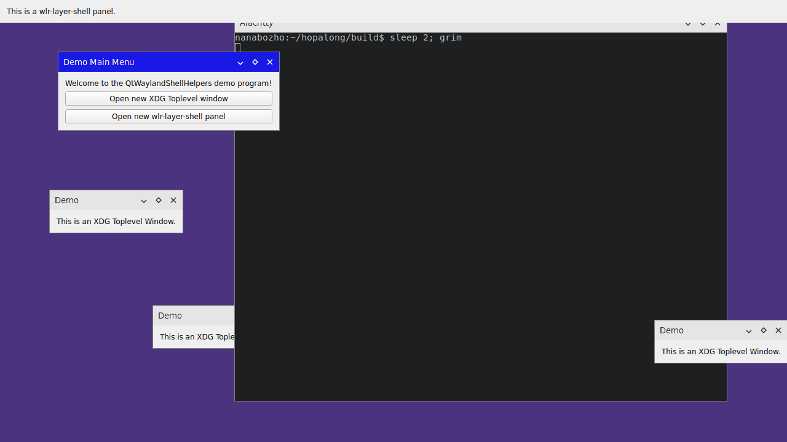

# Qt Wayland Shell Helpers

Use different types of Wayland shell protocols in the same application.

## Screenshot

## Caveats

* Some Qt widgets (built in menus) won't work properly due to the way they
  interact with QPA.
  You probably want to use custom widgets in those scenarios anyway though.

* CSD is probably completely broken.  This is probably fixable.